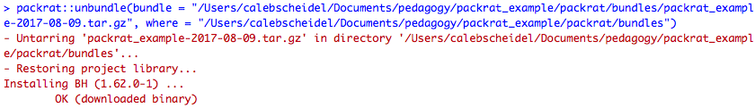

```{r setup, include=FALSE}
knitr::opts_chunk$set(echo = TRUE)
```

## Outline

- What is packrat and why would you want to use it? 

- How to use packrat (common commands, workflows, etc.)

- Using packrat in our repositories

- How to hand-off a packrat project to a client
&nbsp;


# What is `packrat` and why would you want to use it?

## What is `packrat`?

- Packrat is a dependency management system for R

    1. Reproducible 
        - records exact package versions
        
    2. Isolated
        - installing new or updated package from one project won't break your other projects and vice versa
        
    3. Portable
        - can easily transport projects from one computer to another, even across different platforms (Windows, Mac, Linux)
    
## Reproducibility
  
- Packrat helps solve this problem by:
    - Ensuring package sources are stored alongside your project
    - Tracking package versions

## Isolation

- Without packrat, when you install an R package, it gets installed into a global library

    - This can be problematic if you have older projects that depend on older versions of packages
  
        - i.e. a project depends on older versions of dplyr, but you want to use newer versions of dplyr
    
&nbsp;    
    
- Packrat gives each project its own private packrat library

    - if you use packrat to manage an R project, it will tell R to use and load packages from the project's _private_ packrat library instead of the global library
  
    - When you use `install.packages()` the packages will install to the _private_ _packrat_ _library_ if the project is managed by packrat
  
    - Analogy: R packages are like "books"; they live in a "library" and hence you check them out with the `library()` function


## Portability

- If you are working with collaborators/clients, you can ensure that everyone working on a Packrat project is using the same version of any R packages that your project depends on.


# How to use packrat in RStudio

## Using packrat

- Two key components: 
    - Snapshot of your project's R dependencies
    - The private packrat library powering your project

&nbsp;
  
- Two key verbs for interacting with these components:
    - `packrat::snapshot()`
        - records the package versions used by the project and downloads their source code for storage with the project
    - `packrat::restore()`
        - applies the previous snapshot to a directory
        - use when you first open a packrat project (that someone else started) to install all of the needed packages
        - use in case you accidentally remove a package that is needed for the project

## Overview


## `packrat::init()`

- sets up packrat in an existing project


&nbsp;

- Note: once you have made the project a packrat project, you will need to install all needed packages, even if they are installed on your global library

## `packrat::status()`

- Shows the differences between the project's packrat dependencies, its private package library, and its R scripts

- Example: You have `dplyr` installed and loaded into your packrat library and you are using functions from `dplyr` in your project:


## `packrat::snapshot()`

- updates the `packrat.lock` file, which lists the precise package versions that were used to satisfy dependencies the project currently has.
    - Note: the `packrat.lock` file should never be edited by hand!

&nbsp;

- Continuing our example, say we actually wanted to remove `dplyr` from our packrat library, we can use `packrat::snapshot()` to remove this package from our lockfile:


&nbsp;

- Note: Automatic snapshots option will record package upgrades and additions in the background
    - These are on by default, but you can turn off using `packrat::set_opts(auto.snapshot = FALSE)

## `packrat::restore()`

- Applies the most recent snapshot to the project's private library (pulling from the `packrat.lock` file)
- works by adding, removing, and changing packages so that the set of installed packages and their versions on the current local private packrat library matches the snapshot exactly

- Three common use cases for `packrat::restore()`:
    - Hydrate - use `restore()` after copying a project to a new machine to populate the library on that machine
    - Sync - Use `restore()` to apply library changes made by a collaborator to your own library (In general, you want to run `restore()` whenever you pick up a change to `packrat.lock`)
    - Rollback - use `restore()` to undo accidental changes 

## `packrat::restore()`

- After removing `dplyr` from our library, what if we wanted to get it back and written in our lockfile?  We would use `packrat::restore()`:


## `packrat::clean()`

- Removes packages from the library that are installed but not needed for your project

&nbsp;

- Example: We installed a package called `pscl` and do not end up using it anywhere in the project.  To remove it from the packrat library, use `packrat::clean()`:


&nbsp;

- Remember: package removes aren't auto-snapshotted, so save your changes to packrat.lock using `packrat::snapshot()` after you are finished cleaning your library


## Moving in and out of packrat mode

- `packrat::off()`
    - Gets out of packrat mode, i.e. if you want to use stuff in your global library
  
- `packrat::on()`
    - Gets back into packrat mode
  
  
## Other things to know

- All base R packages are already installed and versioned in the private packrat library when you set up packrat in your project
    - in `lib-R` directory
    - All loaded packages go into the `lib` and `src` directory

- You can view your packrat options with `packrat::get_opts()` and change them with `packrat::set_opts()`
  
&nbsp;  
  
- Packrat file structure:


    
# Using `packrat` in our repositories

## `packrat` with RStudio Projects

- One `.Rproj` in top level directory, or multiple nested `.Rproj`'s in each subdirectory with real code in it?
    - There are pros and cons to each
        - One `.Rproj`
            - Pros:
            - Cons:
        
        - Multiple nested `.Rproj`'s
            - Pros:
            - Cons:
    
## Inheriting `packrat` in subdirectories/subprojects

- Is this a good idea?

## Issues

- `formatR` package being removed from `packrat::clean()` but needing to be reinstalled every time you knit

- `packrat::clean(dry.run = TRUE) returns things invisibly, when there are actually packages that need to be cleaned up

# How to hand off a `packrat` project to a client

## Collaboration with `packrat`

- Once a project is ready to be shared with a collaborator or client, it can be "bundled" up using the `packrat::bundle()` function.

- This "bundled" project can then be shared and opened on a client's machine, with all the the packages and dependencies automatically installed when they open the `.Rproj` file or run the `packrat::unbundle()` function.

## `packrat::bundle()`

- Bundles the entire project into a gzipped tarball (`.tar.gz`) file to share with collaborators/clients


&nbsp;

- You can then send this zipped file to the client, and if they have R/RStudio installed they can access it.
  
## `packrat::unbundle()`

- Unbundles the `.tar.gz` file into a new directory on the collaborator/client's machine in the exact same version as the project was bundled, with the same versions of packages and dependencies installed
    
- This automatically happens when the collaborator unzips/opens the `.tar.gz` file and opens the `.Rproj` file on their machine for the first time




## References

- Packrat Documentation:

    - https://rstudio.github.io/packrat/
    
&nbsp;    

- Kevin Ushey's RStudio webinar: 

    - https://www.rstudio.com/resources/webinars/managing-package-dependencies-in-r-with-packrat/ 

&nbsp;

- Brian Connelly's Blog: 

    - http://bconnelly.net/2014/07/creating-reproducible-software-environments-with-packrat/

&nbsp;

- Nishant Upadhyay's post: 

    - http://rstudio-pubs-static.s3.amazonaws.com/221948_fb7215fecb0d49ac903f701fd8d45132.html
